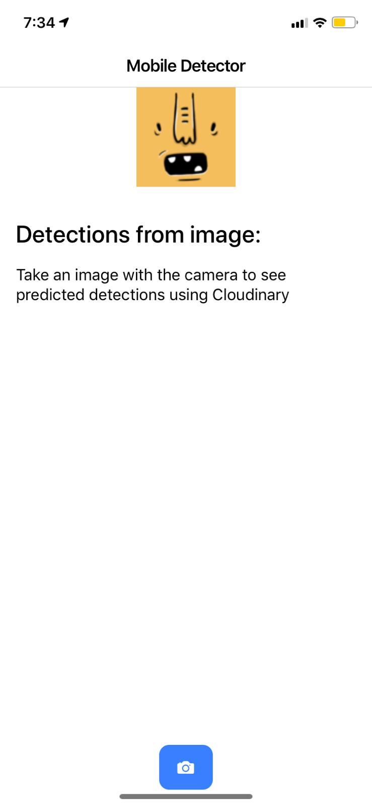
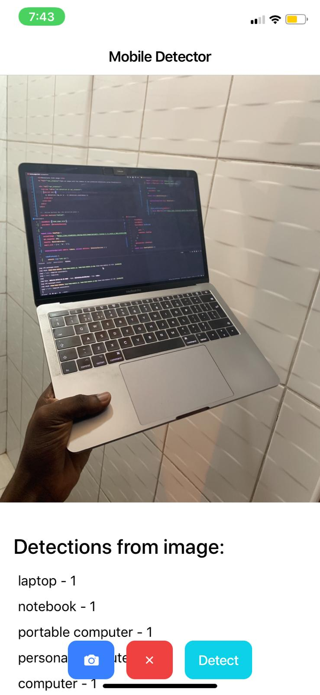
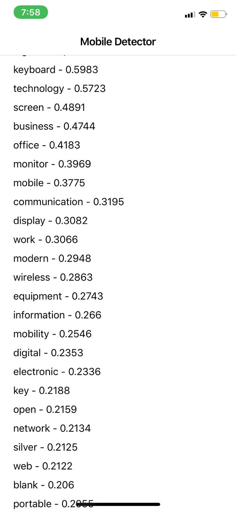
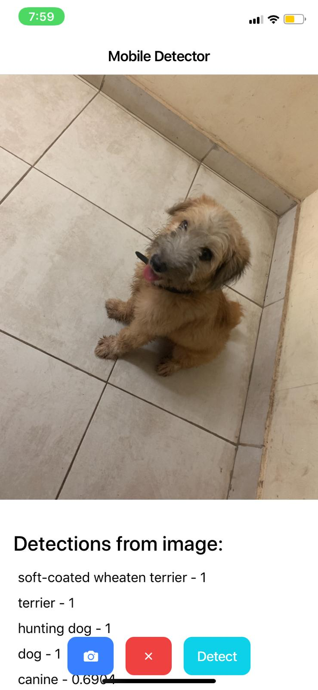
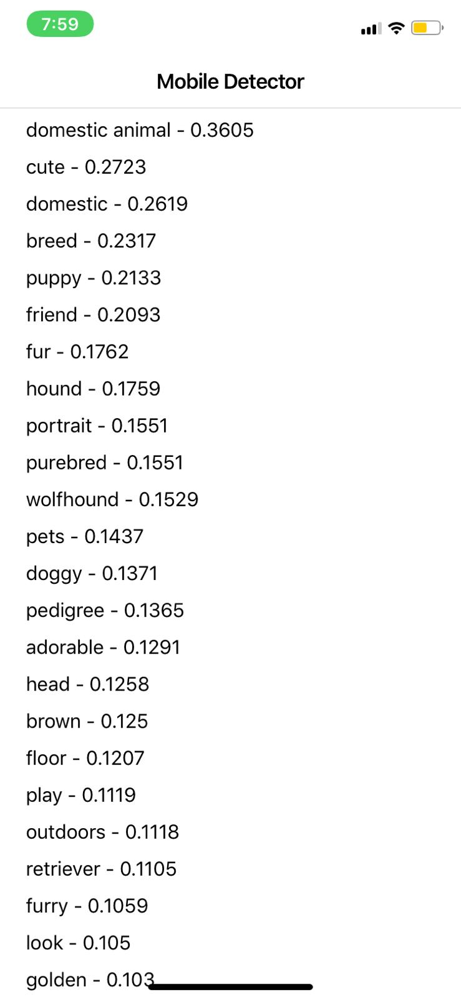

# Mobile Detector
Description
This repository will show how to build a mobile app with realtime object detection built in using Ionic 4, Cloudinary and Pusher







# Getting Started
- Install Dependencies

```bash
npm install
```

- Run the ionic app

```bash
ionic serve -c
```

- Open [Ionic Dev App](https://ionicframework.com/docs/appflow/devapp) to see app at work
